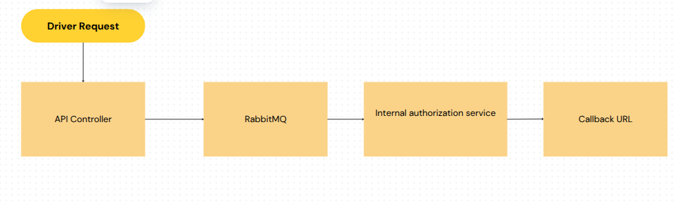

#### Requirements

1. Docker
2. Docker compose
3. Git


#### Setup
1. ```
    git clone https://github.com/kalibano/chargepoint.git
    cd chargepoint

2. ```
    cp .env.exmaple .env

3. build and start container
    ```
    docker-compose up -d --build

4. ```
    docker-compose exec app php artisan migrate --seed

5. ```
    docker-compose exec app php artisan queue:work

#### API Endpoint
1.  URL:  POSThttp://localhost:8000/api/charging-session
    ```
    - Request Body:
            {
                "station_id": "123e4567-e89b-12d3-a456-426614174000",
                "driver_token": "validDriverToken123456789123456789",
                "callback_url": "https://example.com/callback"
            }
    - Response:
        {
            "status": "accepted",
            "message": "Request is being processed asynchronously. The result will be sent to the provided callback URL."
        }

2. RabbitMQ Management UI
- URL: http://localhost:15672

- Username: guest

- Password: guest

3. MySQL Database
- Host: localhost

- Port: 3306

- Username: root

- Password: secret
    
#### Notes
1. Client sends a request to the API Controller( ChargingSessionController).

2. ChargingSessionController validates the request and dispatches a job to RabbitMQ and respond to the client with an acknowledgment:.

3. RabbitMQ queues the job and delivers it to a internal authorization service.

4. Internal authorization service processes the request

6. Persists the decision.

7. Sends the decision to the provided callback URL

 


#### Scalling considration
- use autoscalling and loader balancer to handle traffic load

- Currently using RabbitMQ , we can use Redis or a distributed queue like Kafka for high-traffic scenarios

- Implement retries for failed callback requests

- use any tool to monitor the queue like Kibana, etc